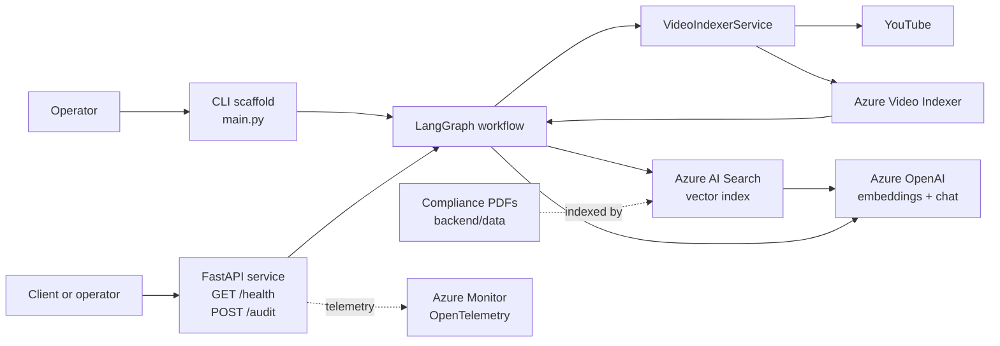
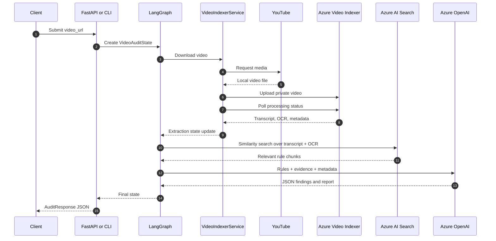
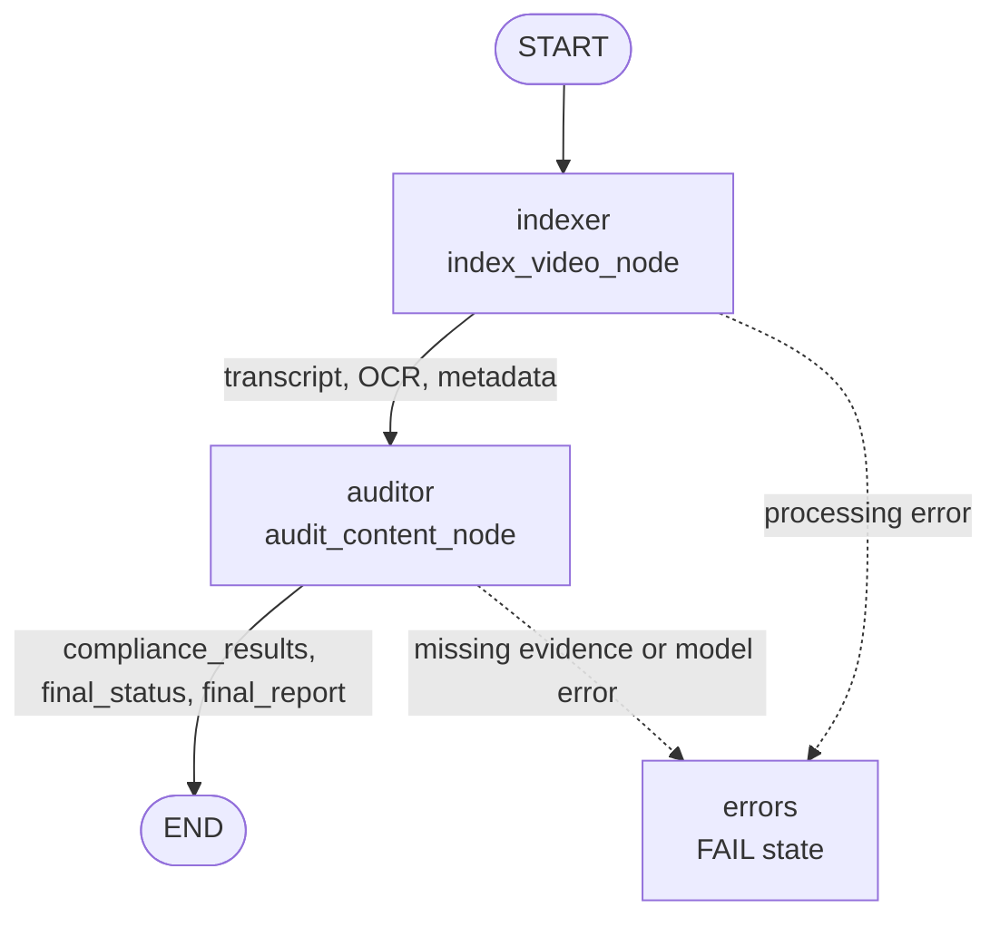
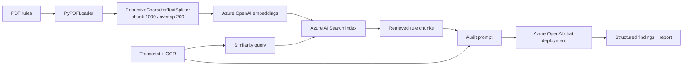

# Brand Guardian AI

Brand Guardian AI is a Python proof of concept for auditing YouTube advertising videos against brand, regulatory, and platform-compliance guidance. The intended system downloads a video, extracts speech and on-screen text with Azure Video Indexer, retrieves relevant rules from Azure AI Search, and asks Azure OpenAI to return structured compliance findings.

## Product flow

An audit is designed to follow this path:

1. A client submits a YouTube URL to the FastAPI API or the CLI scaffold.
2. The video service downloads the media with `yt-dlp`.
3. The media is uploaded privately to Azure Video Indexer.
4. The service polls Video Indexer until processing completes.
5. Transcript, OCR text, and metadata are placed into the LangGraph state.
6. The auditor searches the Azure AI Search vector index for relevant compliance rules.
7. Azure OpenAI receives the retrieved rules and video evidence.
8. The API returns a status, report, and list of compliance issues.

The checked-in knowledge-base sources are:

- `ComplianceQAPipeline/backend/data/youtube-ad-specs.pdf`
- `ComplianceQAPipeline/backend/data/1001a-influencer-guide-508_1.pdf`

## Architecture

### Target system architecture



The diagram describes the intended architecture. In the current source, the LangGraph import path is broken, so the runtime graph is not yet connected successfully.

### Audit request sequence



### LangGraph workflow



The workflow declared in `workflow.py` is linear: `indexer -> auditor -> END`. It has no branching, persistence, retry queue, or background job runner.

### Compliance knowledge-base pipeline



## Repository layout

```text
.
├── README.md
└── ComplianceQAPipeline/
    ├── main.py                         # CLI-style workflow runner
    ├── pyproject.toml                  # Project metadata; Python >= 3.12
    ├── requirements.txt                # Runtime dependencies
    ├── setup.py                         # Legacy setuptools configuration
    ├── uv.lock                          # uv lockfile
    └── backend/
        ├── data/                       # Checked-in PDF compliance sources
        ├── Dockerfile                  # FastAPI container definition
        ├── scripts/
        │   └── index_documents.py      # PDF-to-Azure AI Search indexer
        └── src/
            ├── api/
            │   ├── server.py           # FastAPI app and HTTP models
            │   └── telemetry.py        # Optional Azure Monitor setup
            ├── graph/
            │   ├── __init__.py
            │   ├── state.py            # VideoAuditState and issue schema
            │   ├── node.py             # Intended graph node module
            │   └── workflow.py         # LangGraph construction
            └── services/
                ├── __init__.py
                └── video_indexer.py    # YouTube/Azure Video Indexer client
```

## Technology stack

- Python 3.12+
- FastAPI and Uvicorn for HTTP serving
- LangGraph and LangChain for workflow and retrieval orchestration
- Azure Video Indexer for transcript and OCR extraction
- Azure OpenAI for embeddings and compliance reasoning
- Azure AI Search for the vector knowledge base
- `yt-dlp` and FFmpeg for video acquisition/media handling
- Azure Monitor OpenTelemetry for optional telemetry
- Docker for container packaging

`streamlit`, Redis, PostgreSQL, SQLAlchemy, Firecrawl, Azure Blob Storage, and LangSmith are listed as dependencies, but no corresponding application modules are currently present in this repository.

## Local setup

From the repository root:

```powershell
cd ComplianceQAPipeline
py -3.12 -m venv .venv
.\.venv\Scripts\Activate.ps1
python -m pip install --upgrade pip
python -m pip install -r requirements.txt
```

Create `ComplianceQAPipeline/.env`. `load_dotenv(override=True)` is called by the API, CLI, and indexing script.

### Environment variables

| Variable | Used by | Purpose |
| --- | --- | --- |
| `AZURE_OPENAI_ENDPOINT` | Indexer | Azure OpenAI resource endpoint |
| `AZURE_OPENAI_API_KEY` | Indexer | Azure OpenAI authentication |
| `AZURE_OPENAI_API_VERSION` | Indexer/auditor | API version for Azure OpenAI |
| `AZURE_OPENAI_CHAT_DEPLOYMENT` | Auditor | Chat model deployment name |
| `AZURE_OPENAI_EMBEDDING_DEPLOYMENT` | Indexer | Embedding deployment; defaults to `text-embedding-3-small` |
| `AZURE_SEARCH_ENDPOINT` | Indexer/auditor | Azure AI Search endpoint |
| `AZURE_SEARCH_API_KEY` | Indexer/auditor | Azure AI Search authentication |
| `AZURE_SEARCH_INDEX_NAME` | Indexer/auditor | Vector index name |
| `AZURE_VI_ACCOUNT_ID` | Video service | Video Indexer account |
| `AZURE_VI_LOCATION` | Video service | Video Indexer region |
| `AZURE_SUBSCRIPTION_ID` | Video service | Azure subscription for ARM token exchange |
| `AZURE_RESOURCE_GROUP` | Video service | Resource group containing the Video Indexer account |
| `AZURE_VI_NAME` | Video service | Video Indexer resource name; defaults to `project-brand-guardian-001` |
| `APPLICATIONINSIGHTS_CONNECTION_STRING` | API telemetry | Optional Azure Monitor connection string |

The Video Indexer service uses `DefaultAzureCredential`, so local execution also requires an authenticated Azure CLI session, managed identity, or another supported credential source.

## Indexing the compliance documents

The indexing script loads all PDFs under `backend/data`, splits them into 1,000-character chunks with 200-character overlap, creates embeddings, and uploads the documents to Azure AI Search.

Run it from `ComplianceQAPipeline`:

```powershell
python backend/scripts/index_documents.py
```

The Azure Search index and its vector fields must exist or be provisioned in a way supported by the `AzureSearch` LangChain integration before auditing can retrieve rules.

## API

### Start the API

```powershell
uvicorn backend.src.api.server:app --host 127.0.0.1 --port 8000 --reload
```

The Dockerfile uses the container-safe equivalent:

```text
uvicorn backend.src.api.server:app --host 0.0.0.0 --port 8000
```

### Endpoints

| Method | Path | Description |
| --- | --- | --- |
| `GET` | `/health` | Returns service health information |
| `POST` | `/audit` | Runs a synchronous video audit |
| `GET` | `/docs` | FastAPI Swagger UI |
| `GET` | `/openapi.json` | Generated OpenAPI schema |

Request:

```json
{
  "video_url": "https://www.youtube.com/watch?v=VIDEO_ID"
}
```

The declared response model is:

```json
{
  "session_id": "uuid",
  "video_id": "vid_12345678",
  "status": "PASS|FAIL|UNKNOWN",
  "final_report": "Summary of findings...",
  "compliance_results": [
    {
      "category": "Claim Validation",
      "severity": "CRITICAL",
      "description": "Explanation of the issue"
    }
  ]
}
```

The request is processed synchronously. A real deployment should move video processing to a background worker and return a job identifier.

## CLI scaffold

```powershell
python main.py
```

`main.py` creates a UUID-based session and invokes the graph. Its current `video_url` is an empty string, so it is a demonstration runner rather than a complete command-line interface.

## State model

`backend/src/graph/state.py` defines:

- `ComplianceIssue`: category, description, severity, and optional timestamp.
- `VideoAuditState`: video input, metadata, transcript, OCR text, accumulated compliance results, final status/report, and accumulated errors.

The `Annotated[..., operator.add]` fields are intended to support append-only updates from graph nodes. The API initializes `video_url`, `video_id`, `compliance_results`, and `errors`; extraction and final result fields are populated during execution.

## Container usage

Build from the `ComplianceQAPipeline` directory because the Dockerfile copies both `main.py` and `backend/`:

```powershell
cd ComplianceQAPipeline
docker build -f backend/Dockerfile -t brand-guardian-ai:local .
docker run --rm -p 8000:8000 --env-file .env brand-guardian-ai:local
```

The image is based on `python:3.12-slim`, installs FFmpeg, runs as a non-root `appuser`, exposes port `8000`, and checks `/health`. The container still depends on valid Azure credentials and configuration supplied at runtime.

---
