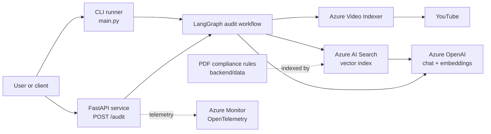
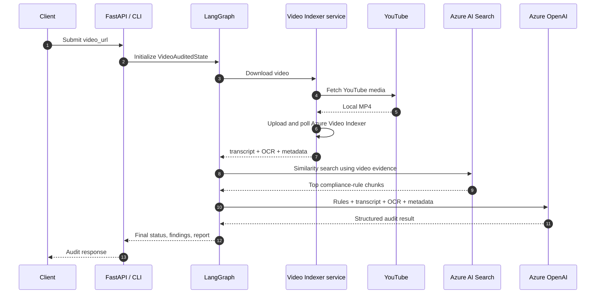
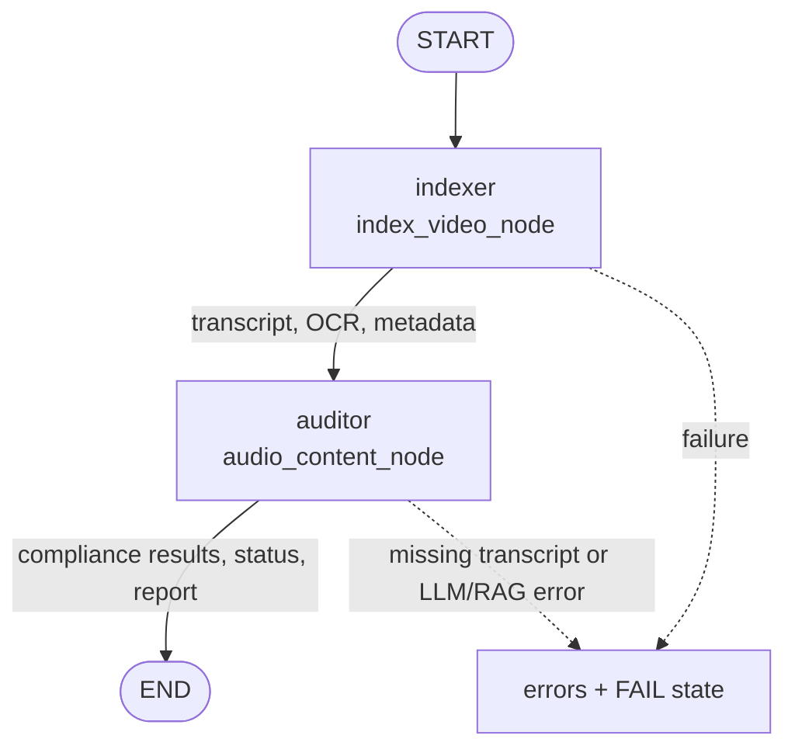
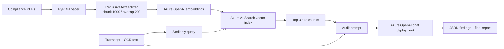

# Brand Guardian AI

Brand Guardian AI is a Python proof-of-concept for auditing YouTube advertising videos against a curated set of brand, regulatory, and platform rules. It combines video transcription/OCR, retrieval-augmented generation (RAG), and a small LangGraph workflow to produce a compliance status, findings, and a summary report.

> **Implementation status:** The repository currently contains the workflow design and service integrations, but it is not yet a clean end-to-end runnable release. See [Known implementation gaps](#known-implementation-gaps) before attempting a production deployment.

## What the project does

The intended audit lifecycle is:

1. Accept a YouTube URL through the CLI or FastAPI endpoint.
2. Download the video locally with `yt-dlp`.
3. Upload it to Azure Video Indexer and wait for processing.
4. Extract a transcript, OCR text, and basic metadata.
5. Search the indexed compliance documents in Azure AI Search.
6. Send the retrieved rules plus the video evidence to an Azure OpenAI chat deployment.
7. Return structured findings with category, severity, description, status, and a final report.

The repository includes two source PDFs used as the intended compliance knowledge base:

- `youtube-ad-specs.pdf`
- `1001a-influencer-guide-508_1.pdf`

## Architecture

### System context



### Audit request sequence



### LangGraph workflow



### Knowledge-base ingestion and RAG path



## Repository layout

```text
.
├── README.md
└── ComplianceQAPipeline/
    ├── main.py                         # CLI-style workflow runner
    ├── pyproject.toml                  # Project metadata; Python >= 3.12
    ├── requirements.txt                # Runtime and integration dependencies
    ├── setup.py                         # Legacy setuptools installer
    └── backend/
        ├── data/                       # Source compliance PDFs
        ├── dockerfile                  # Empty placeholder at present
        ├── scripts/
        │   └── index_documents.py      # Intended PDF-to-Azure Search indexer
        └── src/
            ├── api/
            │   ├── server.py           # FastAPI app and endpoints
            │   └── telemetry.py        # Azure Monitor setup
            ├── graph/
            │   ├── state.py            # LangGraph state schema
            │   ├── node.py             # Indexer and auditor nodes
            │   └── workflow.py         # Compiled graph
            └── services/
                └── video_indexer.py    # YouTube/Azure Video Indexer connector
```

## Technology stack

- Python 3.12 or newer
- FastAPI and Uvicorn for the HTTP API
- LangGraph for orchestration
- LangChain for prompts, embeddings, and vector-store access
- Azure Video Indexer for transcript and OCR extraction
- Azure OpenAI for embeddings and compliance reasoning
- Azure AI Search for the vector knowledge base
- `yt-dlp` for YouTube download
- Azure Monitor OpenTelemetry for optional request telemetry

## Setup

From the repository root:

```powershell
cd ComplianceQAPipeline
py -3.12 -m venv .venv
.\.venv\Scripts\Activate.ps1
python -m pip install --upgrade pip
python -m pip install -r requirements.txt
```

The application loads a `.env` file from the current working directory. Create `ComplianceQAPipeline/.env` and provide the Azure settings required by the path you are running.

### Environment variables

| Variable | Used by | Required for |
| --- | --- | --- |
| `AZURE_OPENAI_ENDPOINT` | Document indexer | Knowledge-base indexing |
| `AZURE_OPENAI_API_KEY` | Document indexer | Knowledge-base indexing |
| `AZURE_OPENAI_CHAT_DEPLOYMENT` | Auditor node | Auditing |
| `AZURE_OPENAI_EMBEDDING_DEPLOYMENT` | Document indexer | Indexing; defaults to `text-embedding-3-small` |
| `AZURE_OPENAI_API_VERSION` | Indexer and auditor | Azure OpenAI calls |
| `AZURE_SEARCH_ENDPOINT` | Indexer and auditor | RAG retrieval |
| `AZURE_SEARCH_API_KEY` | Indexer and auditor | RAG retrieval |
| `AZURE_SEARCH_INDEX_NAME` | Indexer and auditor | RAG retrieval |
| `AZURE_VI_ACCOUNT_ID` | Video Indexer service | Video processing |
| `AZURE_VI_LOCATION` | Video Indexer service | Video processing |
| `AZURE_SUBSCRIPTION_ID` | Video Indexer service | Token generation |
| `AZURE_RESOURCE_GROUP` | Video Indexer service | Token generation |
| `AZURE_VI_NAME` | Video Indexer service | Token generation; defaults to `project-brand-guardian-001` |
| `APPLICATIONINSIGHTS_CONNECTION_STRING` | Telemetry | Optional Azure Monitor telemetry |

The Video Indexer connector uses `DefaultAzureCredential`, so local development normally requires an authenticated Azure CLI session, managed identity, or another supported Azure identity source.

## Knowledge-base indexing

`backend/scripts/index_documents.py` is intended to load every PDF in `backend/data`, split the text into overlapping chunks, generate embeddings, and upload the chunks to Azure AI Search.

The intended command is:

```powershell
python backend/scripts/index_documents.py
```

The current script requires fixes before it can successfully complete indexing; details are listed below.

## Running the API

The API defines:

| Method | Path | Purpose |
| --- | --- | --- |
| `GET` | `/health` | Returns a basic service health payload |
| `POST` | `/audit` | Starts an audit for a YouTube URL |

Intended request:

```json
{
  "video_url": "https://www.youtube.com/watch?v=VIDEO_ID"
}
```

Intended audit response shape:

```json
{
  "session_id": "uuid",
  "video_id": "vid_12345678",
  "status": "PASS|FAIL",
  "final_report": "Summary of findings...",
  "compliance_results": [
    {
      "category": "Claim Validation",
      "severity": "CRITICAL",
      "description": "Explanation of the violation"
    }
  ]
}
```

The intended Uvicorn command is:

```powershell
uvicorn backend.src.api.server:app --host 127.0.0.1 --port 8000 --reload
```

Because the current code has import-time and integration defects, this command should be treated as the target startup command rather than a guarantee that the present checkout boots successfully.

## Running the CLI

```powershell
python main.py
```

`main.py` creates a session and invokes the compiled graph. Its current sample payload contains an empty `video_url`, so it is a scaffold for a future CLI rather than a complete user-facing command-line interface.

## State model

The LangGraph state is defined in `backend/src/graph/state.py` and is intended to carry:

- Input: `video_url`, `video_id`
- Extraction: `local_file_path`, `video_metadata`, `transcript`, `ocr_text`
- Analysis: compliance issues, each with category, description, severity, and optional timestamp
- Delivery: `final_status`, `final_report`
- Reliability: accumulated `errors`

The workflow is deliberately linear today: indexing must finish before auditing begins. There is no persistence layer, job queue, authentication, retry policy, or asynchronous background execution in the current implementation.

## Known implementation gaps

These are visible in the source and should be resolved before describing the service as production-ready:

1. `backend/src/graph/node.py` imports and instantiates `VideoIndexerService`, while `backend/src/services/video_indexer.py` defines `VideoIndexer`.
2. The node calls `extarct_data`, while the service defines `extract_data`.
3. `upload_video()` does not return the uploaded Azure Video Indexer ID and calls `get_account_token()` without the required ARM token argument.
4. Video Indexer polling uses an endpoint/response flow that does not clearly target the uploaded video ID.
5. The auditor writes `final_results`, while the state, CLI, and API read `final_status`.
6. The FastAPI `/audit` route declares `AuditRequest` as its response model, although it returns an `AuditResponse`.
7. The compliance issue schema has an optional `timestamp`, but the API response model omits it; the state field is also named `compliance_result` while callers use `compliance_results`.
8. Several logging calls pass `logging.info` instead of a numeric logging level.
9. `backend/scripts/index_documents.py` contains undefined variables and misspelled Azure Search keyword arguments, including `index_name`, `azure_saerch_endpoint`, and `embeddings_function`.
10. The document indexer computes its data path relative to `backend/scripts`, but the resulting path should be verified against the actual `backend/data` location.
11. `backend/dockerfile` is empty, and there is no test suite, CI configuration, API authentication, or deployment manifest.
12. `streamlit` is listed as a dependency, but no Streamlit application exists in the repository.

## Security and operational notes

- Do not commit `.env` files, API keys, downloaded videos, or Azure credentials.
- Keep uploaded videos private in Azure Video Indexer, as the current connector requests private indexing.
- Validate and constrain accepted URLs before enabling this service for untrusted callers.
- Add request authentication, rate limiting, size/time limits, retries with backoff, and cleanup guarantees before exposing `/audit` publicly.
- Treat LLM output as untrusted input: validate it against a strict schema and retain the raw response only under an appropriate data-retention policy.
- Video processing is synchronous and may take several minutes; a production API should hand work to a background queue and expose job status.

## Suggested next steps

1. Make the service and node names consistent and fix the Video Indexer token/upload/polling flow.
2. Repair the state/result naming mismatch and validate LLM output with Pydantic.
3. Correct the document-indexing script and build the Azure AI Search index from the checked-in PDFs.
4. Add unit tests for state transitions, parsing, failure paths, and API contracts.
5. Add a real container image, secrets configuration, authentication, asynchronous jobs, and CI/CD.

## License

No license file is currently included in the repository.
